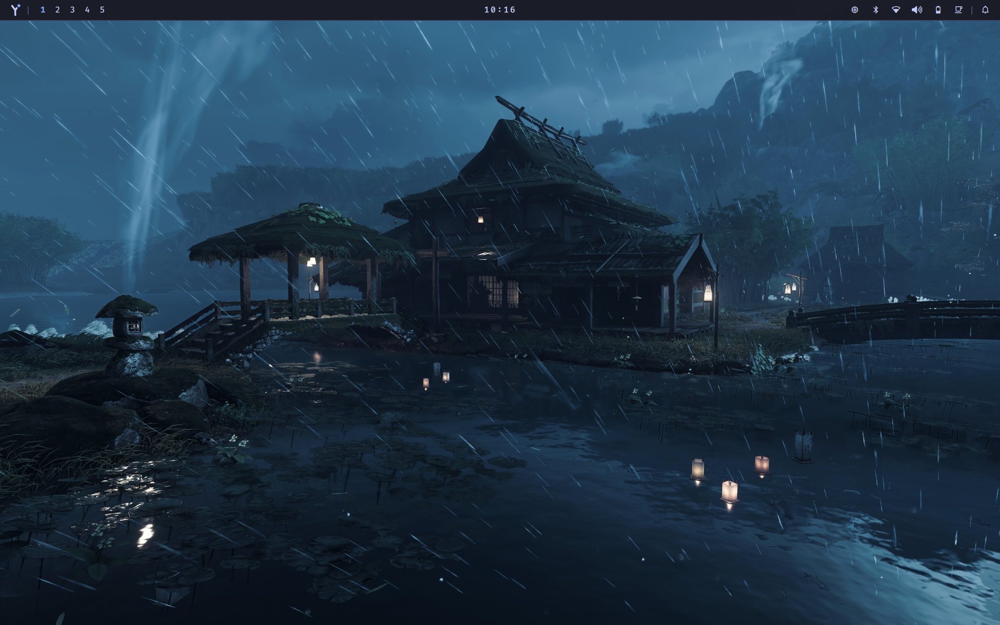
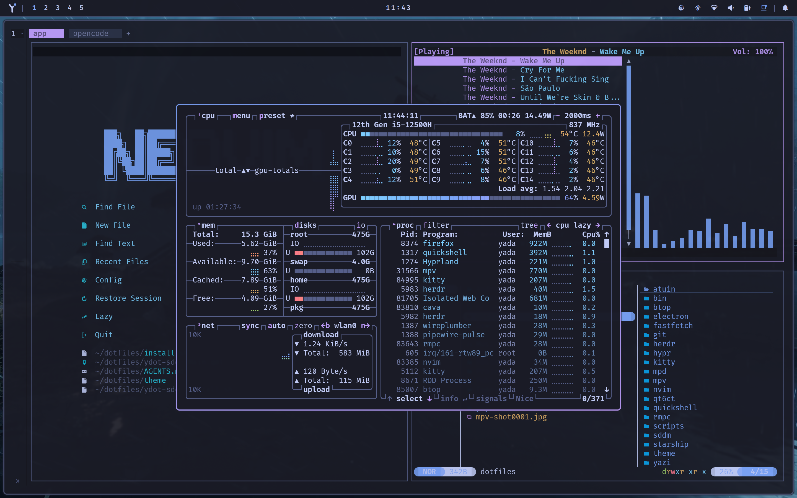
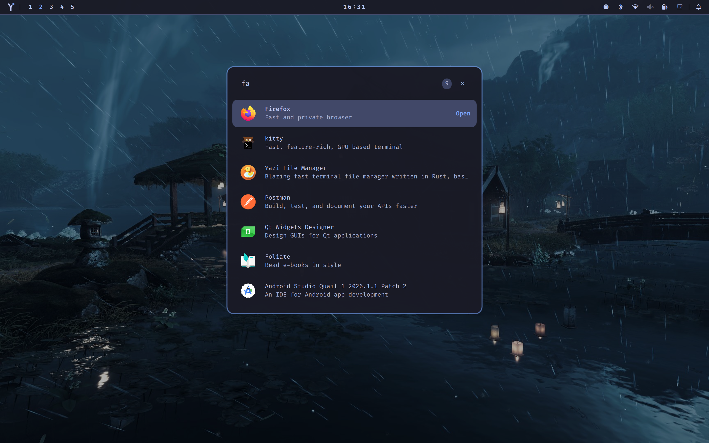
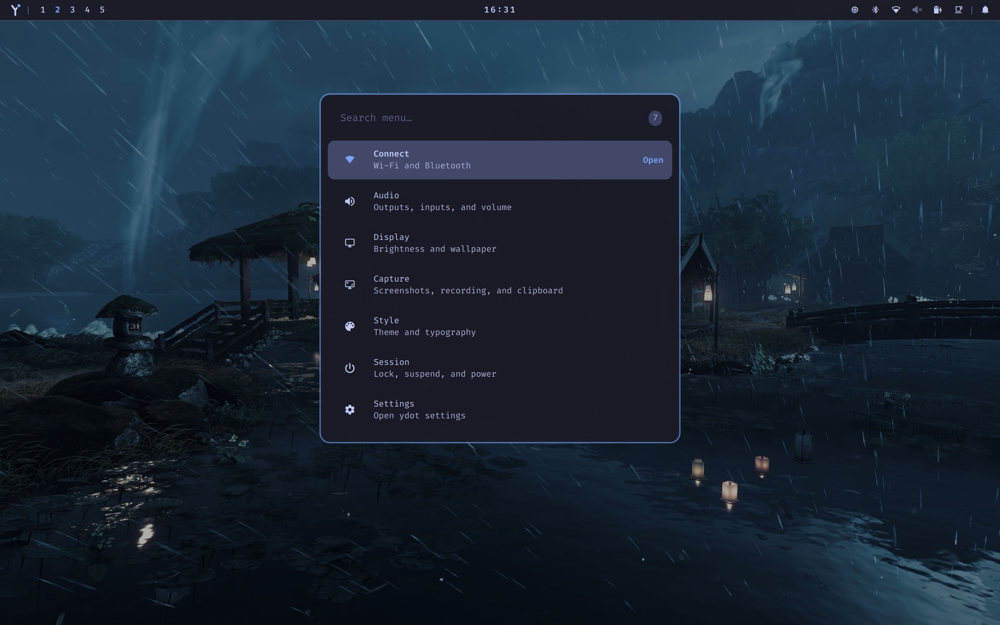
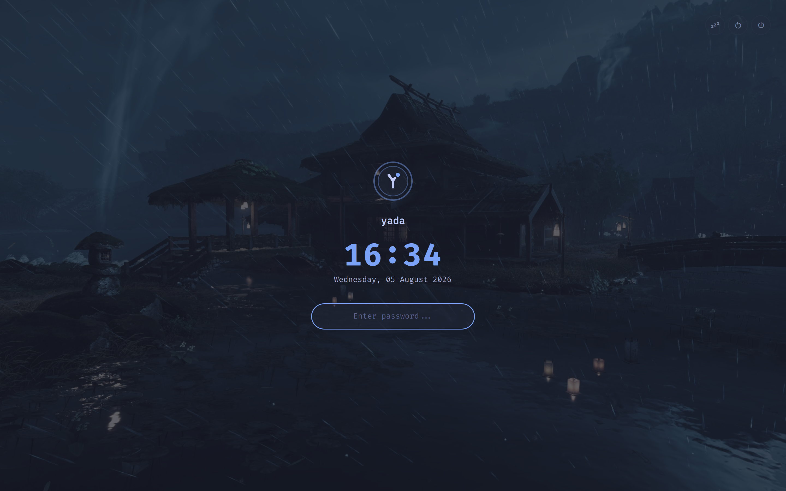
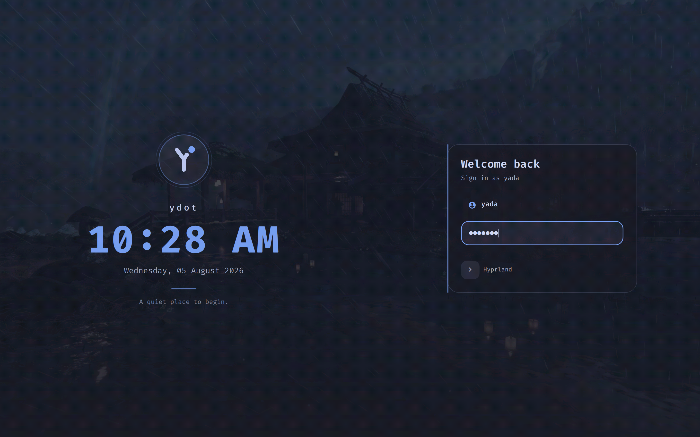

<p align="center">
   
</p>

# ydot

Personal Arch Linux + Hyprland dotfiles built around a centralized theme system. All configs deploy via GNU Stow and are managed from a unified QML shell.

> ⚠️ **Work in progress.** Configs are actively evolving and may break between commits.

## Screenshots








## Features

- **Centralized theme switching** — 3 themes (tokyonight, catppuccin, rosepine) with per-theme wallpapers and fonts
- **Unified QML shell** — Bar, app launcher, settings panel, clipboard history, keybinds overlay, lock screen, power menu
- **Searchable settings panel** — Change theme or font with live search
- **Clipboard history** — `SUPER + V` opens searchable clipboard manager via cliphist
- **Keybinds overlay** — `SUPER + /` shows categorized, searchable keybind reference
- **Wallpaper cycling** — `SUPER + W` cycles wallpapers
- **Hypridle integration** — Auto-lock, DPMS off, and suspend on idle
- **Fully reproducible** — `git clone` + `install.sh` builds the entire environment

## Stack

| Category          | Tool                                      |
|-------------------|-------------------------------------------|
| Compositor        | Hyprland                                  |
| Shell / Bar       | Quickshell (QML)                          |
| Terminal          | Kitty                                     |
| Shell             | Zsh + Starship + antidote                 |
| Editor            | Neovim (Lua), Zed                         |
| Launcher          | Quickshell app launcher                   |
| File Manager      | Yazi, Nemo                                |
| Multiplexer       | herdr                                     |
| Media             | mpv, mpd, rmpc, youtube-tui               |
| Theme System      | colors.json + jq-rendered templates       |
| Qt Theme          | qt6ct (Fusion + Nerd Fonts)               |

## Structure

```
.
├── hypr/           # Hyprland + hypridle (stow → ~)
├── kitty/          # Terminal
├── quickshell/     # QML shell, bar, panels, lock screen
├── nvim/           # Neovim
├── zed/            # Zed
├── theme/          # colors.json + templates (theme-set.sh)
├── zsh/ starship/
├── bin/            # ~/.local/bin scripts
├── scripts/        # NOT stowed — pacman.txt, yay.txt, stow-exclude.txt
├── ydot-sddm/      # NOT stowed — SDDM theme installer
└── install.sh      # Bootstrap (auto-discovers stow packages)
```

Top-level dirs are stow packages rooted at `~`, except those listed in `scripts/stow-exclude.txt`
(`scripts/`, `sddm/`, `ydot-sddm/`, `starship/`). Theme outputs and `~/.config/starship.toml` are
generated by `theme-set.sh`.

Wallpapers live in `~/.local/wallpapers/<theme>/` (cycled with Super+W). Repo seeds are under
`theme/.../themes/<name>/wallpapers/`.

## Prerequisites

- Fresh Arch Linux install
- Hyprland

## Installation

### Fresh install
```sh
curl -fsSL https://raw.githubusercontent.com/yaredow/dotfiles/main/install.sh | sh
```

For a private fork, set `DOTFILES_REPO`:
```sh
DOTFILES_REPO="https://token@github.com/youruser/dotfiles.git" curl -fsSL ... | sh
```

### Existing setup
```sh
git clone https://github.com/yaredow/dotfiles ~/dotfiles
cd ~/dotfiles
./install.sh
```

### Options
```sh
./install.sh --check   # pre-flight checks only (tools, package lists, themes,
                       # and stow conflicts) — makes no changes
./install.sh --help
```

- **Safe to re-run** — a failed run can be recovered by running `install.sh` again.
- Real files that would block GNU Stow are backed up to `~/.local/state/stow-backup-*/` instead of failing the install.
- Everything is logged to `~/.local/state/dotfiles-install.log` (override with `DOTFILES_LOG`).

### Manual stow
```sh
stow */          # symlink all packages
stow hypr kitty  # or just specific ones
stow -D hypr     # unlink a package
```

## Keybinds

| Keys              | Action              |
|-------------------|---------------------|
| `ALT + T`         | Terminal            |
| `ALT + F`         | File Manager        |
| `ALT + Space`     | App launcher        |
| `ALT + W`         | Settings panel      |
| `SUPER + V`       | Clipboard history   |
| `SUPER + /`       | Keybinds reference  |
| `SUPER + W`       | Cycle wallpaper     |
| `SUPER + S`       | Screenshot          |
| `SUPER + L`       | Lock screen         |
| `SUPER + SLASH`   | Keybinds overlay    |
| `XF86PowerOff`    | Power menu          |

## License

[MIT](LICENSE)
